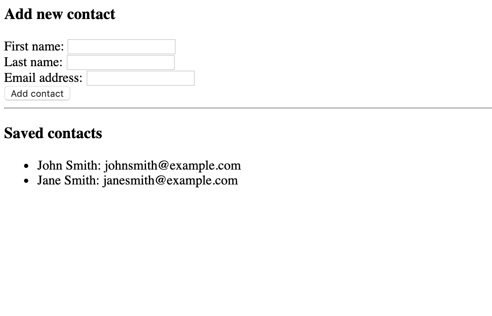

<!-- .slide: id="lesson16" -->

# Basic Frontend - Spring 2020

Lesson 16, Thursday, 2020-04-30

---

### Recap: JSON

JSON is a way of serializing data to a string for transportation (calling APIs with `fetch`) **or** storage.

```js
let myObject = {
    name: 'Owen',
    job: 'Software Developer'
};

let myObjectAsJsonString = JSON.stringify(myObject);
console.log(typeof myObjectAsJsonString); // ???

let otherJsonString = '{"fruits":["apple","banana","grape"]}';
let otherThing = JSON.parse(otherJsonString);
console.log(typeof otherThing); // ???
```

---

### Local storage

Local storage is a browser API that uses the same key-value pair concept as Objects in order to save and retrieve data.

Data saved in this way will persist when the user refreshes the window!

```js
// Saving a value:
localStorage.setItem('key', 'value');
// Loading a value:
let myValue = localStorage.getItem('key');
```
Note that you can only save values of type `string`

---

### Similarities to objects

```js
// Object with key 'name' and value 'Owen'
let teacher = {
    name: 'Owen'
};
console.log(teacher.name);
console.log(teacher['name']);

// These are the same:
teacher.name = 'Harald';
teacher['name'] = 'Harald';

// Local storage is also a key-value store
localStorage.setItem('name', 'Owen');
let value = localStorage.getItem('name');
console.log(value); // ???
```

---

### Storing in local storage with JSON

`localStorage.setItem` and `getItem` only save and retrieve String type data.
How do we save more complex data structures? JSON strings!

```js
let person = {
    name: 'Owen',
    age: 28
};
let personAsJsonString = JSON.stringify(person);
localStorage.setItem('savedPerson', personAsJsonString);
// User refreshes the page...
let someJsonString = localStorage.getItem('savedPerson');
let something = JSON.parse(someJsonString);
console.log(something.name); // ???
```
Remeber that arrays can also be converted to and from JSON!

---

### In-class project: Create an address book

Basic requirements:
* It should be a form with labels and inputs for first name, last name, and email address, with a save button
* It should display all contacts in a list below the form

---

### In-class project: Create an address book

Advanced requirements:
* It should also save to local storage, so that when the page is refreshed, the saved contacts are still there
* Each saved contact should have a delete button that lets you remove it

---

### Example screenshot



Can you begin to guess how you might complete this task with the tools you've learned?

---

### Tools required

* Click handler functions with `onclick`
* Reading data from DOM elements with `document.getElementById`
* Creating objects `{ name: 'Owen' }`
* Saving to and loading from localStorage 
 * Must save as a JSON string with `JSON.stringify`

---

### Strategizing

Before you start, define distinct tasks:

1. An HTML form with the 3 inputs mentioned in the description, plus save button
2. Click handler function for the save button that saves the form data in memory
 * I recommend saving contacts as an **array** of **objects**
3. A function renders list item (`li`) elements for each contact.

---

### Strategizing

The advanced requirements can be done in any order as long as the basic requirements are completed first.

---

### Step 1

Write the HTML form with the 3 inputs mentioned in the description and a save button

(~10 minutes)

---

### Step 1 Example

```html
<html>
  <body>
    <div>
      <label for="firstnameInput">First name:</label>
      <input id="firstnameInput" type="text">
      <br/>
      
      <label for="lastnameInput">Last name:</label>
      <input id="lastnameInput" type="text">
      <br/>
      
      <label for="emailInput">Email address:</label>
      <input id="emailInput" type="text">
      <br/>
      
      <button>Add contact</button>
    </div>
    <ul id="contactList"></ul>

    <script src="main.js"></script>
  </body>
</html>
```

---

### Step 2

Write the click handler for the save button that saves the form data in memory and connect it to your save button `onclick`

(~30 minutes)

---

### Step 2 Example

```js
// main.js

let myContacts = [];

// add this to your button onclick in the html
function addContactClick() {
    let firstName = document.getElementById('firstNameInput').value;
    let lastName = document.getElementById('lastNameInput').value;
    let emailAddress = document.getElementById('emailInput').value;

    let newContact = {
        firstName: firstName,
        lastName: lastName,
        emailAddress: emailAddress
    };

    myContacts.push(newContact);
}
```

---

### Step 3

Now that you have the contacts saved into an array, write the code that renders list item (`li`) elements for each contact.

(~30 minutes)

---

### Step 3 example

```js
function renderContacts() {
    let listElement = document.getElementById('contactList');

    // Clear out the existing list of contacts
    listElement.innerHTML = "";

    // Re-add all of our contacts
    for (let i = 0; i < myContacts.length; i++) {
        let contact = myContacts[i];
        let newContactListItem = document.createElement('li');
        newContactListItem.textContent = contact.firstName + ' ' + contact.lastName + ': ' + contact.emailAddress;
        listElement.appendChild(newContactListItem);
    }
}
```
Now this needs to be called whenever you call .push on myContacts

---

### Advanced requirements: Saving to local storage

Create a helper function to save to local storage every time you click the save button, and another one to load from local storage.

---

### Local storage example

```js
let LOCAL_STORAGE_KEY = 'addressBookContacts';

function saveContacts() {
    let contactsAsJsonString = JSON.stringify(myContacts);
    localStorage.setItem(LOCAL_STORAGE_KEY, contactsAsJsonString);
}

function loadContacts() {
    let savedContactsAsJsonString = localStorage.getItem(LOCAL_STORAGE_KEY);
    if (savedContactsAsJsonString) {
        myContacts = JSON.parse(savedContactsAsJsonString);
    }
}
```

When should you call these functions?

---

### Advanced requirements (Bonus!): 'Delete contact' button

When you are creating each contact list item, you will need to add an additional button.

Hint: Very similar to the todo list exercise!
